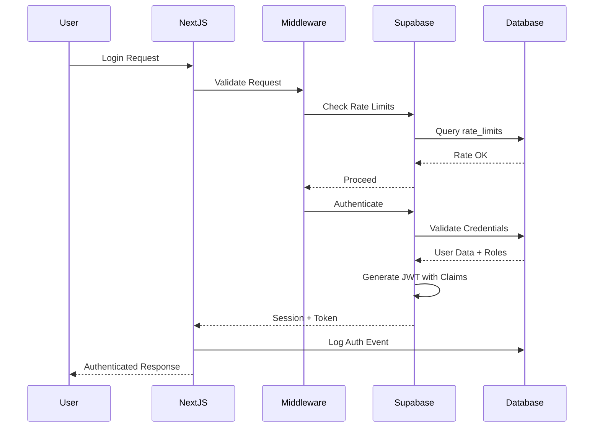
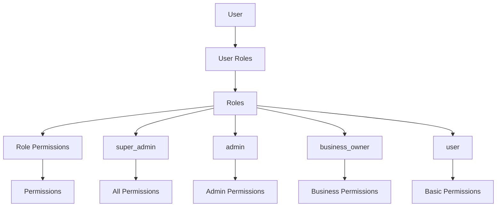

# Authentication Architecture Documentation
## Epic 2 Story 2.1: Complete Authentication Infrastructure

## Table of Contents
1. [Overview](#overview)
2. [Architecture Components](#architecture-components)
3. [Database Schema](#database-schema)
4. [Security Features](#security-features)
5. [Implementation Guide](#implementation-guide)
6. [API Reference](#api-reference)
7. [Security Checklist](#security-checklist)

## Overview

The authentication infrastructure provides enterprise-grade security with comprehensive features including:

- **JWT-based authentication** with custom claims for RBAC
- **Multi-factor authentication (MFA)** support with TOTP, SMS, and backup codes
- **OAuth integration** for Google, Apple, Facebook, and GitHub
- **Role-Based Access Control (RBAC)** with granular permissions
- **Session management** with device tracking and geographic information
- **Security monitoring** with audit logging and threat detection
- **Rate limiting** to prevent brute force attacks
- **Row Level Security (RLS)** for database-level access control

## Architecture Components

### 1. Database Layer
```
┌─────────────────────────────────────────────────────┐
│                   Supabase Database                  │
├─────────────────────────────────────────────────────┤
│  Core Tables:                                        │
│  • profiles - User profile information               │
│  • roles - System and custom roles                   │
│  • permissions - Granular permissions                │
│  • user_roles - User-role assignments                │
│                                                       │
│  MFA Tables:                                         │
│  • auth_mfa_config - MFA settings per user          │
│  • auth_mfa_challenges - MFA verification tracking   │
│                                                       │
│  Session Tables:                                     │
│  • user_sessions - Active session tracking           │
│  • session_activities - Session activity logs        │
│  • trusted_devices - Device trust management         │
│                                                       │
│  Security Tables:                                    │
│  • rate_limits - Rate limiting tracking              │
│  • security_events - Security incident logging       │
│  • auth_audit_logs - Authentication audit trail      │
│  • password_history - Password reuse prevention      │
│                                                       │
│  OAuth Tables:                                       │
│  • oauth_providers - OAuth provider configurations   │
│  • user_oauth_connections - User OAuth links         │
└─────────────────────────────────────────────────────┘
```

### 2. Authentication Flow


### 3. RBAC System


## Database Schema

### Core Authentication Tables

#### profiles
```sql
- id: UUID (PK, FK to auth.users)
- display_name: VARCHAR(255)
- username: VARCHAR(50) UNIQUE
- avatar_url: VARCHAR(500)
- email_verified: BOOLEAN
- phone_verified: BOOLEAN
- account_status: VARCHAR(50)
- last_login_at: TIMESTAMPTZ
- last_login_ip: INET
```

#### roles
```sql
- id: UUID (PK)
- name: VARCHAR(50) UNIQUE
- display_name: VARCHAR(100)
- hierarchy_level: INTEGER
- is_system_role: BOOLEAN
- requires_mfa: BOOLEAN
```

#### user_roles
```sql
- id: UUID (PK)
- user_id: UUID (FK to auth.users)
- role_id: UUID (FK to roles)
- granted_by: UUID (FK to auth.users)
- expires_at: TIMESTAMPTZ
- scope_type: VARCHAR(50)
- scope_id: UUID
```

## Security Features

### 1. Multi-Factor Authentication (MFA)

#### Supported Methods:
- **TOTP (Time-based One-Time Password)**: Compatible with Google Authenticator, Authy
- **SMS**: Text message verification
- **Email**: Email-based verification codes
- **Backup Codes**: One-time use recovery codes

#### Implementation:
```typescript
// Enable MFA
const { secret, backup_codes, qr_code } = await authService.enableMFA('totp')

// Verify MFA
const isValid = await authService.verifyMFA(code, 'totp')
```

### 2. Session Management

#### Features:
- Device fingerprinting and tracking
- Geographic location tracking
- Concurrent session limits
- Session activity monitoring
- Automatic session expiration
- Manual session revocation

#### Session Data:
```typescript
interface Session {
  id: string
  user_id: string
  device_type: string
  device_name: string
  browser: string
  os: string
  ip_address: string
  country: string
  city: string
  last_activity: Date
  expires_at: Date
}
```

### 3. Rate Limiting

#### Configuration:
```typescript
// API Rate Limits
- Default: 100 requests per minute
- Authentication: 5 attempts per 15 minutes
- Password Reset: 3 attempts per hour
- MFA Verification: 5 attempts per 10 minutes
```

### 4. Password Security

#### Requirements:
- Minimum 12 characters
- At least one uppercase letter
- At least one number
- At least one special character
- No reuse of last 12 passwords
- Password strength validation

### 5. Audit Logging

#### Logged Events:
- User registration
- Login attempts (success/failure)
- Password changes
- MFA enablement/verification
- Role assignments
- Permission changes
- Security incidents
- Session activities

## Implementation Guide

### 1. Environment Setup

Create `.env.local`:
```bash
# Supabase Configuration
NEXT_PUBLIC_SUPABASE_URL=your-project-url
NEXT_PUBLIC_SUPABASE_ANON_KEY=your-anon-key
SUPABASE_SERVICE_ROLE_KEY=your-service-role-key

# OAuth Providers (optional)
NEXT_PUBLIC_GOOGLE_CLIENT_ID=your-google-client-id
NEXT_PUBLIC_APPLE_CLIENT_ID=your-apple-client-id
NEXT_PUBLIC_FACEBOOK_CLIENT_ID=your-facebook-client-id
NEXT_PUBLIC_GITHUB_CLIENT_ID=your-github-client-id

# Site Configuration
NEXT_PUBLIC_SITE_URL=http://localhost:3000
```

### 2. Database Migration

Run migrations in order:
```bash
# 1. Create authentication infrastructure
supabase migration up 006_authentication_infrastructure.sql

# 2. Create RBAC functions
supabase migration up 007_auth_functions_rbac.sql

# 3. Apply RLS policies
supabase migration up 008_auth_rls_policies.sql
```

### 3. Client Setup

```typescript
// app/layout.tsx
import { AuthProvider } from '@/lib/auth/hooks'

export default function RootLayout({ children }) {
  return (
    <html>
      <body>
        <AuthProvider>
          {children}
        </AuthProvider>
      </body>
    </html>
  )
}
```

### 4. Protected Routes

```typescript
// app/dashboard/page.tsx
import { useRequireAuth } from '@/lib/auth/hooks'

export default function Dashboard() {
  const { user, isLoading } = useRequireAuth()
  
  if (isLoading) return <Loading />
  
  return <DashboardContent user={user} />
}
```

### 5. Role-Based Access

```typescript
// app/admin/page.tsx
import { useRequireRole } from '@/lib/auth/hooks'

export default function AdminPanel() {
  const { user, isLoading } = useRequireRole('admin')
  
  if (isLoading) return <Loading />
  
  return <AdminContent user={user} />
}
```

## API Reference

### Authentication Service

#### Methods:
```typescript
// Sign up
authService.signUp(email: string, password: string, metadata?: any)

// Sign in
authService.signIn(email: string, password: string)

// Sign in with OAuth
authService.signInWithOAuth(provider: 'google' | 'apple' | 'facebook' | 'github')

// Sign in with magic link
authService.signInWithMagicLink(email: string)

// Sign out
authService.signOut()

// Get current user
authService.getCurrentUser(): Promise<AuthUser>

// Reset password
authService.resetPassword(email: string)

// Update password
authService.updatePassword(newPassword: string)

// Update profile
authService.updateProfile(updates: Partial<Profile>)

// Check role
authService.hasRole(roleName: string): Promise<boolean>

// Check permission
authService.hasPermission(resource: string, action: string): Promise<boolean>

// Enable MFA
authService.enableMFA(type: 'totp' | 'sms')

// Verify MFA
authService.verifyMFA(code: string, type: 'totp' | 'sms' | 'backup_code')
```

### React Hooks

#### useAuth()
```typescript
const {
  user,
  session,
  isLoading,
  error,
  signIn,
  signUp,
  signOut,
  hasRole,
  hasPermission
} = useAuth()
```

#### useRequireAuth()
```typescript
const { user, isLoading } = useRequireAuth(redirectUrl?: string)
```

#### useRequireRole()
```typescript
const { user, isLoading } = useRequireRole(role: string, redirectUrl?: string)
```

#### useMFA()
```typescript
const {
  mfaEnabled,
  isLoading,
  enableMFA,
  verifyMFA,
  disableMFA
} = useMFA()
```

#### useSessions()
```typescript
const {
  sessions,
  isLoading,
  revokeSession,
  revokeAllSessions
} = useSessions()
```

## Security Checklist

### Pre-Deployment
- [ ] Environment variables configured securely
- [ ] Service role key not exposed to client
- [ ] HTTPS enabled in production
- [ ] CORS configured properly
- [ ] CSP headers configured
- [ ] Rate limiting enabled
- [ ] Password policies enforced
- [ ] MFA available for sensitive roles

### Database Security
- [ ] RLS policies enabled on all tables
- [ ] Service role usage minimized
- [ ] Sensitive data encrypted
- [ ] Audit logging enabled
- [ ] Regular backups configured
- [ ] Connection pooling optimized

### Application Security
- [ ] Input validation on all forms
- [ ] XSS protection enabled
- [ ] CSRF protection enabled
- [ ] SQL injection prevention
- [ ] Session timeout configured
- [ ] Secure cookie settings
- [ ] Security headers configured

### Monitoring
- [ ] Authentication metrics tracked
- [ ] Failed login monitoring
- [ ] Suspicious activity detection
- [ ] Rate limit monitoring
- [ ] Error tracking configured
- [ ] Performance monitoring
- [ ] Audit log retention

### Compliance
- [ ] GDPR compliance implemented
- [ ] Data retention policies defined
- [ ] Privacy policy updated
- [ ] Terms of service updated
- [ ] Cookie consent implemented
- [ ] Data export capability
- [ ] Account deletion capability

## Testing

### Unit Tests
```bash
npm test lib/auth/**/*.test.ts
```

### Integration Tests
```bash
npm test tests/auth/**/*.test.ts
```

### Security Tests
```bash
npm run security:audit
npm run security:penetration
```

## Troubleshooting

### Common Issues

#### 1. JWT Token Expired
```typescript
// Solution: Refresh the session
await authService.refreshSession()
```

#### 2. Rate Limit Exceeded
```typescript
// Solution: Wait for the lockout period or contact support
// Check rate limit status
const isAllowed = await checkRateLimit(identifier, action)
```

#### 3. MFA Code Invalid
```typescript
// Solution: Ensure time is synced on the device
// Use backup codes if TOTP fails
const isValid = await verifyMFA(backupCode, 'backup_code')
```

#### 4. Session Not Persisting
```typescript
// Solution: Check cookie settings and middleware configuration
// Ensure cookies are enabled in the browser
```

## Support

For additional support or questions about the authentication system:
- Review the [Supabase Auth Documentation](https://supabase.io/docs/guides/auth)
- Check the [Next.js Authentication Guide](https://nextjs.org/docs/authentication)
- Contact the development team

---

*Last Updated: 2025-01-25*
*Version: 1.0.0*
*Epic 2 Story 2.1 Implementation*
