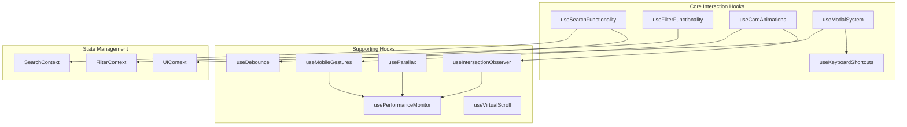

# Story 1.3: Interactive Features Implementation Roadmap

## Hook Architecture Design & Relationships

### System Architecture Overview



## Detailed Hook Specifications

### 1. usePageAnimation Hook

**Purpose**: Manages page load animations and transitions

**Dependencies**:
- useIntersectionObserver (existing)
- usePerformanceMonitor (existing)

**Implementation**:
```typescript
interface UsePageAnimationConfig {
  enableAnimations?: boolean
  reducedMotion?: boolean
  staggerDelay?: number
  animationDuration?: number
}

interface UsePageAnimationReturn {
  isPageReady: boolean
  animationPhase: 'loading' | 'entering' | 'ready'
  triggerPageTransition: (direction: 'in' | 'out') => void
  registerElement: (ref: RefObject<HTMLElement>, options?: AnimationOptions) => void
}

const usePageAnimation = (config: UsePageAnimationConfig): UsePageAnimationReturn
```

**Key Features**:
- Orchestrates page-level animations
- Respects prefers-reduced-motion
- Manages font loading states
- Coordinates with component animations

### 2. useSearchFunctionality Hook

**Purpose**: Complete search experience management

**Dependencies**:
- useDebounce (to be created)
- useKeyboardNavigation (to be created)
- React Query for caching

**Implementation**:
```typescript
interface SearchConfig {
  debounceMs?: number
  minQueryLength?: number
  maxSuggestions?: number
  enableHistory?: boolean
}

interface UseSearchReturn {
  query: string
  setQuery: (query: string) => void
  suggestions: SearchSuggestion[]
  isLoading: boolean
  selectedIndex: number
  handleKeyDown: (e: KeyboardEvent) => void
  selectSuggestion: (index: number) => void
  clearSearch: () => void
  searchHistory: string[]
}

const useSearchFunctionality = (config: SearchConfig): UseSearchReturn
```

**State Flow**:
1. User input → Debounce → API call
2. Suggestions received → Format → Display
3. Selection → Update state → Trigger search
4. Results → Cache → Display

### 3. useFilterFunctionality Hook

**Purpose**: Multi-dimensional filtering system

**Dependencies**:
- FilterContext for global state
- useTransition for non-blocking updates

**Implementation**:
```typescript
interface FilterConfig {
  categories: string[]
  sortOptions: SortOption[]
  enableMultiSelect?: boolean
  persistFilters?: boolean
}

interface UseFilterReturn {
  activeFilters: FilterState
  toggleFilter: (category: string) => void
  clearFilters: () => void
  sortBy: (option: SortOption) => void
  filteredCount: number
  isFiltering: boolean
}

const useFilterFunctionality = (config: FilterConfig): UseFilterReturn
```

**Performance Optimizations**:
- Use useMemo for filtered results
- Implement virtual scrolling for large datasets
- Batch filter updates

### 4. useCardAnimations Hook

**Purpose**: Business card interaction orchestration

**Dependencies**:
- useIntersectionObserver (existing)
- useMobileGestures (existing)
- RAF for smooth animations

**Implementation**:
```typescript
interface CardAnimationConfig {
  staggerDelay?: number
  animationDuration?: number
  enableHover?: boolean
  enablePremiumEffects?: boolean
}

interface UseCardAnimationsReturn {
  registerCard: (ref: RefObject<HTMLElement>, index: number) => void
  animateCard: (cardId: string, animation: AnimationType) => void
  highlightPremium: (cardId: string) => void
  resetAnimations: () => void
}

const useCardAnimations = (config: CardAnimationConfig): UseCardAnimationsReturn
```

**Animation Sequences**:
1. Initial load: Staggered fade-in
2. Hover: Scale + shadow elevation
3. Click: Ripple effect
4. Premium: Shimmer + glow

### 5. useModalSystem Hook

**Purpose**: Modal lifecycle and focus management

**Dependencies**:
- Focus trap library
- Portal for rendering
- useKeyboardShortcuts (existing)

**Implementation**:
```typescript
interface ModalConfig {
  closeOnEscape?: boolean
  closeOnClickOutside?: boolean
  enableAnimations?: boolean
  focusTrap?: boolean
}

interface UseModalReturn {
  isOpen: boolean
  openModal: (content: ReactNode) => void
  closeModal: () => void
  modalRef: RefObject<HTMLDivElement>
  backdropRef: RefObject<HTMLDivElement>
}

const useModalSystem = (config: ModalConfig): UseModalReturn
```

**Focus Management Strategy**:
1. Store previous focus
2. Move focus to modal
3. Trap focus within modal
4. Restore focus on close

### 6. useKeyboardShortcuts Hook

**Purpose**: Global keyboard navigation

**Implementation**:
```typescript
interface ShortcutConfig {
  shortcuts: Record<string, () => void>
  enableInInputs?: boolean
  preventDefault?: boolean
}

interface UseKeyboardShortcutsReturn {
  registerShortcut: (key: string, handler: () => void) => void
  unregisterShortcut: (key: string) => void
  isShortcutActive: (key: string) => boolean
}

const useKeyboardShortcuts = (config: ShortcutConfig): UseKeyboardShortcutsReturn
```

**Default Shortcuts**:
- Cmd/Ctrl + K: Focus search
- Escape: Close modal/clear search
- Arrow keys: Navigate suggestions
- Enter: Select item
- Tab: Focus navigation

## State Management Strategy

### 1. Context Architecture

```typescript
// SearchContext
interface SearchContextValue {
  searchState: SearchState
  searchActions: SearchActions
}

// FilterContext  
interface FilterContextValue {
  filterState: FilterState
  filterActions: FilterActions
}

// UIContext
interface UIContextValue {
  uiState: UIState
  uiActions: UIActions
}
```

### 2. State Distribution

**Local State (Component Level)**:
- Animation states
- Temporary UI states
- Form inputs
- Hover states

**Context State (Feature Level)**:
- Search query and results
- Active filters
- Modal open/close
- User preferences

**Global State (App Level)**:
- User authentication
- Business data cache
- Performance metrics
- Feature flags

### 3. State Update Patterns

**Optimistic Updates**:
```typescript
const optimisticUpdate = async (action: Action) => {
  // Update UI immediately
  dispatch({ type: 'OPTIMISTIC_UPDATE', payload: action })
  
  try {
    // Perform actual update
    const result = await api.update(action)
    dispatch({ type: 'UPDATE_SUCCESS', payload: result })
  } catch (error) {
    // Revert on failure
    dispatch({ type: 'UPDATE_FAILURE', payload: error })
  }
}
```

## Performance Optimization Approach

### 1. Rendering Optimizations

**Memoization Strategy**:
```typescript
// Expensive computations
const filteredResults = useMemo(
  () => applyFilters(businesses, activeFilters),
  [businesses, activeFilters]
)

// Component memoization
const BusinessCard = memo(({ business }) => {
  // Component implementation
}, (prevProps, nextProps) => {
  return prevProps.business.id === nextProps.business.id
})
```

**Code Splitting**:
```typescript
// Lazy load heavy components
const BusinessDetailModal = lazy(() => import('./BusinessDetailModal'))
const AdvancedFilters = lazy(() => import('./AdvancedFilters'))
```

### 2. Animation Performance

**RAF Scheduling**:
```typescript
const scheduleAnimation = (callback: () => void) => {
  let rafId: number
  
  const animate = () => {
    callback()
    rafId = requestAnimationFrame(animate)
  }
  
  rafId = requestAnimationFrame(animate)
  
  return () => cancelAnimationFrame(rafId)
}
```

**CSS Transform Optimization**:
```typescript
// Use transform instead of position
const animateCard = (element: HTMLElement, x: number, y: number) => {
  element.style.transform = `translate3d(${x}px, ${y}px, 0)`
  element.style.willChange = 'transform'
}
```

### 3. Virtual Scrolling

**Implementation for Large Lists**:
```typescript
interface VirtualScrollConfig {
  itemHeight: number
  containerHeight: number
  buffer: number
}

const useVirtualScroll = (items: any[], config: VirtualScrollConfig) => {
  const [visibleRange, setVisibleRange] = useState({ start: 0, end: 10 })
  
  const handleScroll = (scrollTop: number) => {
    const start = Math.floor(scrollTop / config.itemHeight)
    const end = Math.ceil((scrollTop + config.containerHeight) / config.itemHeight)
    
    setVisibleRange({
      start: Math.max(0, start - config.buffer),
      end: Math.min(items.length, end + config.buffer)
    })
  }
  
  return {
    visibleItems: items.slice(visibleRange.start, visibleRange.end),
    totalHeight: items.length * config.itemHeight,
    offsetY: visibleRange.start * config.itemHeight
  }
}
```

## Mobile Interaction Patterns

### 1. Touch Gesture Implementation

**Swipe Actions**:
```typescript
const swipeActions = {
  left: {
    action: 'showQuickActions',
    threshold: 75,
    haptic: 'light'
  },
  right: {
    action: 'addToFavorites',
    threshold: 75,
    haptic: 'medium'
  }
}
```

**Long Press Menu**:
```typescript
const longPressConfig = {
  delay: 500,
  actions: [
    { label: 'Call', icon: 'phone', action: 'call' },
    { label: 'Directions', icon: 'map', action: 'directions' },
    { label: 'Share', icon: 'share', action: 'share' }
  ]
}
```

### 2. Responsive Touch Targets

**Minimum Sizes**:
- Buttons: 44x44px
- Links: 44px height
- Form inputs: 48px height
- Cards: Full width touch area

### 3. Mobile-Specific Optimizations

**Passive Event Listeners**:
```typescript
element.addEventListener('touchstart', handler, { passive: true })
element.addEventListener('touchmove', handler, { passive: true })
```

**Reduced Motion**:
```typescript
const prefersReducedMotion = window.matchMedia('(prefers-reduced-motion: reduce)').matches

const animationDuration = prefersReducedMotion ? 0 : 300
```

## Implementation Priority & Sequencing

### Phase 1: Foundation (Week 1)
1. **Day 1-2**: Core hook structure setup
   - Create base hook templates
   - Set up TypeScript interfaces
   - Configure testing environment

2. **Day 3-4**: State management
   - Implement Context providers
   - Set up Redux/Zustand if needed
   - Create state utilities

3. **Day 5**: Integration setup
   - Connect existing hooks
   - Verify dependencies
   - Create demo components

### Phase 2: Core Features (Week 2)
1. **Day 1-2**: Search functionality
   - Implement useSearchFunctionality
   - Add debouncing logic
   - Create suggestion system

2. **Day 3-4**: Filter system
   - Build useFilterFunctionality
   - Add animation transitions
   - Implement state persistence

3. **Day 5**: Card animations
   - Create useCardAnimations
   - Add stagger effects
   - Implement hover states

### Phase 3: Advanced Features (Week 3)
1. **Day 1-2**: Modal system
   - Build useModalSystem
   - Add focus management
   - Implement animations

2. **Day 3-4**: Mobile gestures
   - Enhance useMobileGestures
   - Add haptic feedback
   - Test on devices

3. **Day 5**: Keyboard navigation
   - Complete shortcut system
   - Add accessibility features
   - Document shortcuts

### Phase 4: Optimization (Week 4)
1. **Day 1-2**: Performance tuning
   - Implement virtual scrolling
   - Optimize re-renders
   - Add lazy loading

2. **Day 3-4**: Testing & QA
   - Write comprehensive tests
   - Performance benchmarking
   - Cross-browser testing

3. **Day 5**: Polish & Documentation
   - Final animations
   - Error handling
   - Complete documentation

## Testing Strategy

### Unit Testing Priorities
1. Hook logic validation
2. State management flows
3. Event handler functions
4. Utility functions
5. Animation calculations

### Integration Testing Focus
1. Search to results flow
2. Filter application
3. Modal interactions
4. Gesture recognition
5. Keyboard navigation

### Performance Testing Metrics
1. Initial load time < 2s
2. Search response < 500ms
3. Animation FPS > 55
4. Memory usage < 50MB
5. Touch response < 100ms

## Risk Mitigation

### Technical Risks
1. **Performance Degradation**
   - Mitigation: Continuous monitoring
   - Fallback: Disable animations

2. **Browser Compatibility**
   - Mitigation: Progressive enhancement
   - Fallback: Polyfills for critical features

3. **Mobile Performance**
   - Mitigation: Device testing matrix
   - Fallback: Simplified mobile version

### UX Risks
1. **Complex Interactions**
   - Mitigation: User testing
   - Fallback: Simplified UI options

2. **Accessibility Issues**
   - Mitigation: Regular audits
   - Fallback: Alternative navigation

## Success Criteria

### Technical Metrics
- 100% feature parity with prototype
- Performance metrics maintained or improved
- Zero critical bugs
- 90%+ test coverage

### User Experience Metrics
- Task completion rate > 95%
- Error rate < 2%
- Satisfaction score > 4.5/5
- Accessibility score 100%

## Conclusion

This implementation roadmap provides a clear path for migrating interactive features while ensuring performance, accessibility, and user delight. The phased approach allows for iterative development and testing, reducing risk while maintaining momentum.