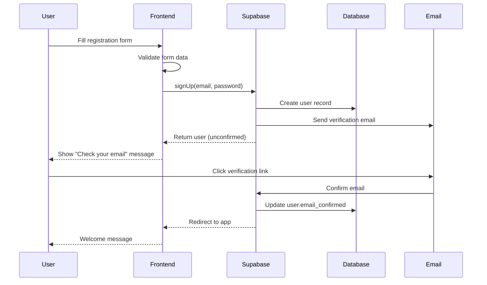
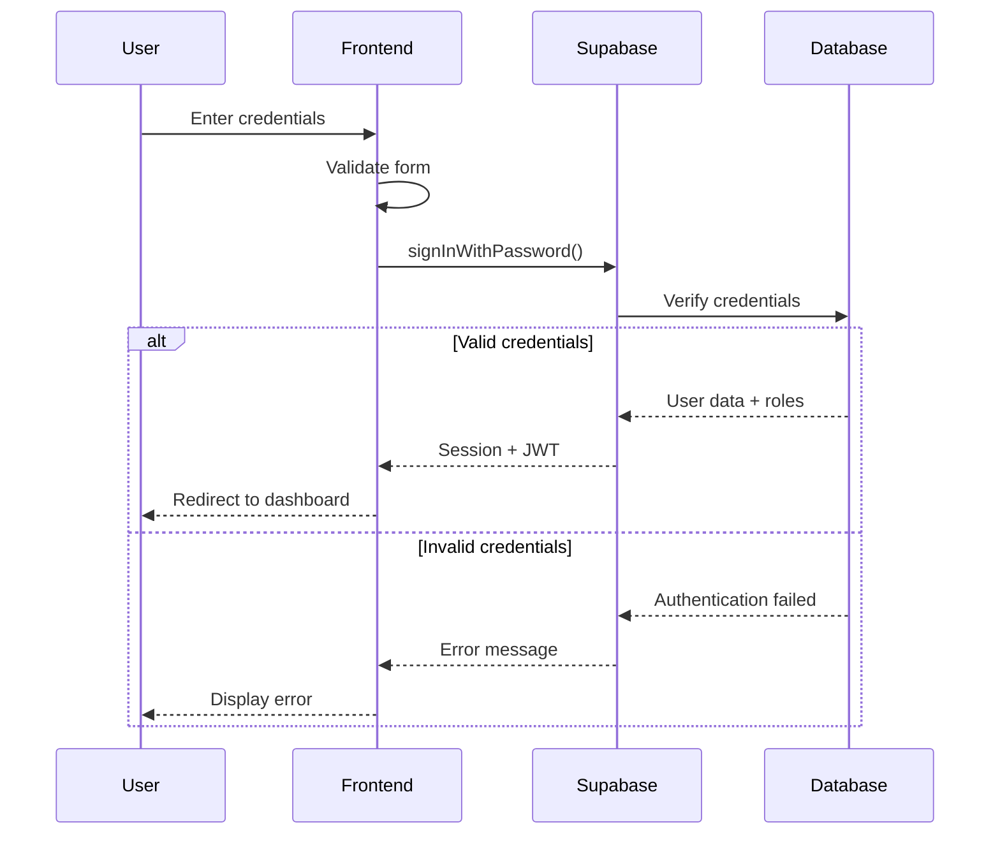
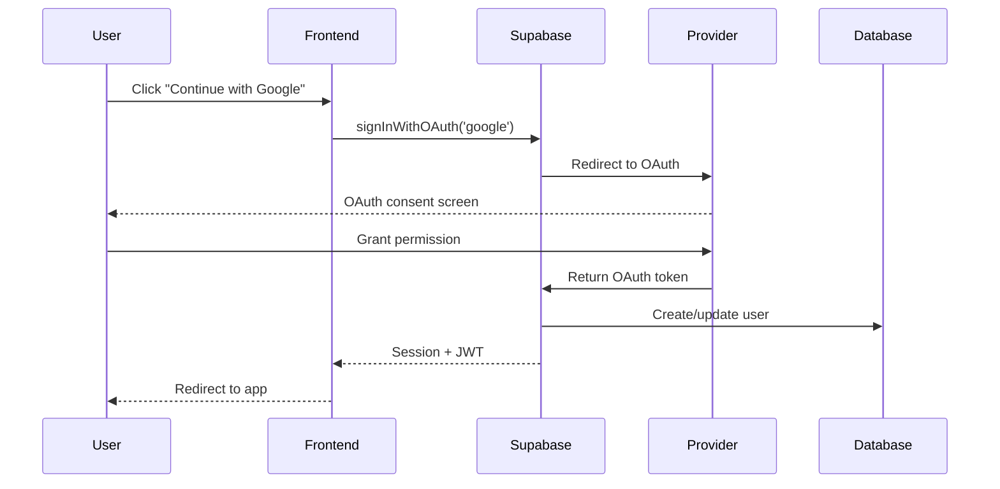

# Authentication System API Reference & Integration Guide

**Created:** 2025-08-26  
**Purpose:** Comprehensive API documentation and integration guide for The Lawless Directory authentication system  
**Audience:** Developers, System Integrators, Third-party Services  

## Table of Contents
- [Quick Start Guide](#quick-start-guide)
- [Authentication Flow Overview](#authentication-flow-overview)
- [API Reference](#api-reference)
- [Client Integration](#client-integration)
- [Server-Side Implementation](#server-side-implementation)
- [Security Best Practices](#security-best-practices)
- [Troubleshooting](#troubleshooting)
- [FAQ](#faq)

## Quick Start Guide

### Prerequisites
- Next.js 14+ application with App Router
- Supabase project with authentication enabled
- Environment variables configured

### Basic Setup

1. **Install Dependencies**
```bash
npm install @supabase/ssr @supabase/supabase-js
npm install react-hook-form @hookform/resolvers/zod zod
```

2. **Environment Configuration**
```env
NEXT_PUBLIC_SUPABASE_URL=your_supabase_url
NEXT_PUBLIC_SUPABASE_ANON_KEY=your_anon_key
SUPABASE_SERVICE_ROLE_KEY=your_service_role_key
```

3. **Client Setup**
```typescript
// lib/supabase/client.ts
import { createBrowserClient } from '@supabase/ssr'

export const createClient = () => {
  return createBrowserClient(
    process.env.NEXT_PUBLIC_SUPABASE_URL!,
    process.env.NEXT_PUBLIC_SUPABASE_ANON_KEY!
  )
}
```

4. **Server Setup**
```typescript
// lib/supabase/server.ts
import { createServerClient } from '@supabase/ssr'
import { cookies } from 'next/headers'

export const createClient = () => {
  const cookieStore = cookies()
  
  return createServerClient(
    process.env.NEXT_PUBLIC_SUPABASE_URL!,
    process.env.NEXT_PUBLIC_SUPABASE_ANON_KEY!,
    {
      cookies: {
        getAll() {
          return cookieStore.getAll()
        },
        setAll(cookiesToSet) {
          try {
            cookiesToSet.forEach(({ name, value, options }) => {
              cookieStore.set(name, value, options)
            })
          } catch {
            // Server Component - handled by middleware
          }
        },
      },
    }
  )
}
```

5. **Authentication Context**
```typescript
// contexts/AuthContext.tsx
'use client'

import { createContext, useContext, useEffect, useState } from 'react'
import { createClient } from '@/lib/supabase/client'
import type { User, Session } from '@supabase/supabase-js'

interface AuthContextType {
  user: User | null
  session: Session | null
  loading: boolean
  signIn: (email: string, password: string) => Promise<AuthResult>
  signUp: (email: string, password: string) => Promise<AuthResult>
  signOut: () => Promise<void>
}

const AuthContext = createContext<AuthContextType | undefined>(undefined)

export function useAuth() {
  const context = useContext(AuthContext)
  if (!context) {
    throw new Error('useAuth must be used within AuthProvider')
  }
  return context
}

export function AuthProvider({ children }: { children: React.ReactNode }) {
  // Implementation details...
}
```

## Authentication Flow Overview

### User Registration Flow


### Login Flow


### Social Authentication Flow


## API Reference

### Authentication Methods

#### Email/Password Authentication

**Sign Up**
```typescript
const { data, error } = await supabase.auth.signUp({
  email: 'user@example.com',
  password: 'securepassword123',
  options: {
    data: {
      display_name: 'John Doe',
      user_type: 'user'
    },
    emailRedirectTo: 'https://yourapp.com/auth/callback'
  }
})
```

**Sign In**
```typescript
const { data, error } = await supabase.auth.signInWithPassword({
  email: 'user@example.com',
  password: 'securepassword123'
})
```

**Sign Out**
```typescript
const { error } = await supabase.auth.signOut()
```

#### Social Authentication

**Google OAuth**
```typescript
const { data, error } = await supabase.auth.signInWithOAuth({
  provider: 'google',
  options: {
    redirectTo: 'https://yourapp.com/auth/callback',
    queryParams: {
      access_type: 'offline',
      prompt: 'consent'
    }
  }
})
```

**Apple Sign-In**
```typescript
const { data, error } = await supabase.auth.signInWithOAuth({
  provider: 'apple',
  options: {
    redirectTo: 'https://yourapp.com/auth/callback'
  }
})
```

#### Magic Link Authentication

**Send Magic Link**
```typescript
const { error } = await supabase.auth.signInWithOtp({
  email: 'user@example.com',
  options: {
    emailRedirectTo: 'https://yourapp.com/auth/callback'
  }
})
```

### Password Management

#### Reset Password
```typescript
const { error } = await supabase.auth.resetPasswordForEmail(
  'user@example.com',
  {
    redirectTo: 'https://yourapp.com/auth/reset-password'
  }
)
```

#### Update Password
```typescript
const { data, error } = await supabase.auth.updateUser({
  password: 'newSecurePassword123'
})
```

### User Profile Management

#### Get User Profile
```typescript
const { data: profile, error } = await supabase
  .from('profiles')
  .select('*')
  .eq('id', user.id)
  .single()
```

#### Update User Profile
```typescript
const { error } = await supabase
  .from('profiles')
  .update({
    display_name: 'New Name',
    bio: 'Updated bio',
    avatar_url: 'https://example.com/avatar.jpg'
  })
  .eq('id', user.id)
```

#### Delete User Account
```typescript
const { error } = await supabase.auth.admin.deleteUser(user.id)
```

### Role-Based Access Control

#### Check User Permissions
```typescript
const { data: permissions, error } = await supabase
  .rpc('get_user_permissions', { user_uuid: user.id })

// Check specific permission
const hasPermission = permissions?.some(p => p.permission === 'businesses.create')
```

#### Assign Role to User
```typescript
const { error } = await supabase
  .from('user_roles')
  .insert({
    user_id: userId,
    role: 'business_owner',
    scope_type: 'global',
    assigned_by: currentUser.id
  })
```

### Business Verification

#### Submit Business Claim
```typescript
const { data: claim, error } = await supabase
  .from('business_claims')
  .insert({
    user_id: user.id,
    business_id: businessId,
    verification_method: 'phone',
    claim_data: {
      phoneNumber: '+1234567890',
      businessName: 'My Business',
      // additional verification data
    }
  })
  .select()
  .single()
```

#### Check Verification Status
```typescript
const { data: claim, error } = await supabase
  .from('business_claims')
  .select(`
    *,
    verification_steps(*)
  `)
  .eq('id', claimId)
  .single()
```

## Client Integration

### React Hook Form Integration

```typescript
import { useForm } from 'react-hook-form'
import { zodResolver } from '@hookform/resolvers/zod'
import { z } from 'zod'

const loginSchema = z.object({
  email: z.string().email('Invalid email address'),
  password: z.string().min(8, 'Password must be at least 8 characters'),
  rememberMe: z.boolean().optional()
})

type LoginFormData = z.infer<typeof loginSchema>

export function LoginForm() {
  const { signIn } = useAuth()
  
  const {
    register,
    handleSubmit,
    formState: { errors, isSubmitting }
  } = useForm<LoginFormData>({
    resolver: zodResolver(loginSchema)
  })

  const onSubmit = async (data: LoginFormData) => {
    try {
      await signIn(data.email, data.password)
      // Handle success
    } catch (error) {
      // Handle error
    }
  }

  return (
    <form onSubmit={handleSubmit(onSubmit)}>
      <input
        {...register('email')}
        type="email"
        placeholder="Email"
        aria-invalid={errors.email ? 'true' : 'false'}
      />
      {errors.email && <span>{errors.email.message}</span>}
      
      <input
        {...register('password')}
        type="password"
        placeholder="Password"
        aria-invalid={errors.password ? 'true' : 'false'}
      />
      {errors.password && <span>{errors.password.message}</span>}
      
      <label>
        <input
          {...register('rememberMe')}
          type="checkbox"
        />
        Remember me
      </label>
      
      <button type="submit" disabled={isSubmitting}>
        {isSubmitting ? 'Signing in...' : 'Sign In'}
      </button>
    </form>
  )
}
```

### Permission-based Component Rendering

```typescript
import { usePermissions } from '@/hooks/usePermissions'

interface PermissionGuardProps {
  permission: string | string[]
  resourceId?: string
  fallback?: React.ReactNode
  children: React.ReactNode
  requireAll?: boolean
}

export function PermissionGuard({
  permission,
  resourceId,
  fallback = null,
  children,
  requireAll = false
}: PermissionGuardProps) {
  const { hasPermission, hasAnyPermission, hasAllPermissions, loading } = usePermissions()

  if (loading) return <LoadingSpinner />

  const permissions = Array.isArray(permission) ? permission : [permission]
  
  let hasAccess = false
  
  if (Array.isArray(permission)) {
    hasAccess = requireAll 
      ? hasAllPermissions(permissions)
      : hasAnyPermission(permissions)
  } else {
    hasAccess = hasPermission(permission, resourceId)
  }

  return hasAccess ? <>{children}</> : <>{fallback}</>
}

// Usage
export function BusinessManagement() {
  return (
    <PermissionGuard 
      permission="businesses.manage"
      fallback={<div>You don't have permission to manage businesses.</div>}
    >
      <BusinessManagementContent />
    </PermissionGuard>
  )
}
```

### Real-time Authentication State

```typescript
import { useEffect, useState } from 'react'
import { useAuth } from '@/contexts/AuthContext'
import { createClient } from '@/lib/supabase/client'

export function useRealtimeAuth() {
  const { user } = useAuth()
  const [authEvents, setAuthEvents] = useState<AuthEvent[]>([])
  
  useEffect(() => {
    if (!user) return

    const supabase = createClient()
    
    const subscription = supabase
      .channel('auth-events')
      .on('postgres_changes', {
        event: 'INSERT',
        schema: 'public',
        table: 'auth_audit_logs',
        filter: `user_id=eq.${user.id}`
      }, (payload) => {
        setAuthEvents(prev => [payload.new as AuthEvent, ...prev])
      })
      .subscribe()

    return () => subscription.unsubscribe()
  }, [user])

  return { authEvents }
}
```

## Server-Side Implementation

### Middleware Protection

```typescript
// middleware.ts
import { updateSession } from '@/lib/supabase/middleware'
import { type NextRequest, NextResponse } from 'next/server'

export async function middleware(request: NextRequest) {
  const response = await updateSession(request)
  
  const pathname = request.nextUrl.pathname
  
  // Define protected routes
  const protectedRoutes = ['/dashboard', '/business', '/admin']
  const isProtectedRoute = protectedRoutes.some(route => 
    pathname.startsWith(route)
  )
  
  if (isProtectedRoute) {
    // Check authentication in the response
    const user = response.headers.get('x-user-id')
    
    if (!user) {
      const loginUrl = new URL('/auth/login', request.url)
      loginUrl.searchParams.set('redirect_to', pathname)
      return NextResponse.redirect(loginUrl)
    }
  }
  
  return response
}

export const config = {
  matcher: [
    '/((?!api|_next/static|_next/image|favicon.ico|.*\\.(?:svg|png|jpg|jpeg|gif|webp)$).*)',
  ],
}
```

### Server Actions

```typescript
// app/actions/auth.ts
'use server'

import { createClient } from '@/lib/supabase/server'
import { redirect } from 'next/navigation'
import { z } from 'zod'

const signInSchema = z.object({
  email: z.string().email(),
  password: z.string().min(8)
})

export async function signInAction(formData: FormData) {
  const rawFormData = {
    email: formData.get('email') as string,
    password: formData.get('password') as string,
  }

  const validatedFields = signInSchema.safeParse(rawFormData)

  if (!validatedFields.success) {
    return {
      errors: validatedFields.error.flatten().fieldErrors,
    }
  }

  const { email, password } = validatedFields.data
  const supabase = createClient()

  const { error } = await supabase.auth.signInWithPassword({
    email,
    password,
  })

  if (error) {
    return {
      message: error.message,
    }
  }

  redirect('/dashboard')
}

export async function signOutAction() {
  const supabase = createClient()
  await supabase.auth.signOut()
  redirect('/auth/login')
}
```

### Protected Server Components

```typescript
// app/dashboard/page.tsx
import { createClient } from '@/lib/supabase/server'
import { redirect } from 'next/navigation'

export default async function DashboardPage() {
  const supabase = createClient()

  const { data: { user }, error } = await supabase.auth.getUser()

  if (error || !user) {
    redirect('/auth/login')
  }

  // Fetch user-specific data
  const { data: profile } = await supabase
    .from('profiles')
    .select('*')
    .eq('id', user.id)
    .single()

  return (
    <div>
      <h1>Welcome back, {profile?.display_name || user.email}!</h1>
      <UserDashboard user={user} profile={profile} />
    </div>
  )
}
```

## Security Best Practices

### Environment Security
```bash
# Production environment variables
NEXT_PUBLIC_SUPABASE_URL=https://your-project.supabase.co
NEXT_PUBLIC_SUPABASE_ANON_KEY=your_anon_key_here
SUPABASE_SERVICE_ROLE_KEY=your_service_role_key_here

# Never commit these to version control
# Use environment-specific .env files
```

### Password Security
```typescript
// Password validation schema
const passwordSchema = z
  .string()
  .min(12, 'Password must be at least 12 characters')
  .regex(/[a-z]/, 'Password must contain at least one lowercase letter')
  .regex(/[A-Z]/, 'Password must contain at least one uppercase letter')
  .regex(/[0-9]/, 'Password must contain at least one number')
  .regex(/[^a-zA-Z0-9]/, 'Password must contain at least one special character')
```

### Session Security
```typescript
// Secure session configuration
const supabaseConfig = {
  auth: {
    autoRefreshToken: true,
    persistSession: true,
    detectSessionInUrl: true,
    flowType: 'pkce' // Use PKCE for OAuth flows
  },
  global: {
    headers: {
      'X-Client-Info': 'your-app@1.0.0',
    },
  },
  cookies: {
    // Secure cookie settings
    name: 'auth-token',
    lifetime: 60 * 60 * 24 * 7, // 7 days
    domain: process.env.NODE_ENV === 'production' ? '.yourdomain.com' : undefined,
    sameSite: 'lax',
    secure: process.env.NODE_ENV === 'production'
  }
}
```

### Rate Limiting
```typescript
// Implement rate limiting for auth endpoints
const rateLimitConfig = {
  login: {
    windowMs: 15 * 60 * 1000, // 15 minutes
    max: 5, // 5 attempts per window
    message: 'Too many login attempts, please try again later'
  },
  registration: {
    windowMs: 60 * 60 * 1000, // 1 hour
    max: 3, // 3 registrations per hour per IP
    message: 'Too many registration attempts, please try again later'
  },
  passwordReset: {
    windowMs: 60 * 60 * 1000, // 1 hour
    max: 3, // 3 reset attempts per hour
    message: 'Too many password reset attempts, please try again later'
  }
}
```

## Troubleshooting

### Common Issues

#### "Session not found" Error
**Problem**: User appears logged out after page refresh
**Solution**: 
1. Check middleware configuration
2. Verify cookie settings
3. Ensure proper server/client component usage

```typescript
// Correct server component pattern
export default async function ProtectedPage() {
  const supabase = createClient()
  const { data: { user } } = await supabase.auth.getUser()
  
  if (!user) {
    redirect('/auth/login')
  }
  
  return <div>Protected content</div>
}
```

#### OAuth Redirect Issues
**Problem**: OAuth flow fails or redirects to wrong URL
**Solution**:
1. Check OAuth provider settings in Supabase dashboard
2. Verify redirect URLs match exactly
3. Ensure HTTPS in production

```typescript
// Correct OAuth configuration
const { data, error } = await supabase.auth.signInWithOAuth({
  provider: 'google',
  options: {
    redirectTo: `${window.location.origin}/auth/callback`
  }
})
```

#### Permission Denied Errors
**Problem**: Users can't access resources they should have permission for
**Solution**:
1. Check RLS policies in Supabase
2. Verify user role assignments
3. Test permission functions

```sql
-- Debug permission query
SELECT 
  ur.role,
  p.permission,
  ur.scope_type,
  ur.scope_id
FROM user_roles ur
JOIN role_permissions rp ON ur.role = rp.role
JOIN permissions p ON rp.permission_id = p.id
WHERE ur.user_id = 'user-uuid-here'
AND ur.active = true;
```

#### Slow Authentication Performance
**Problem**: Authentication operations are slow
**Solution**:
1. Enable database query logging
2. Check for missing indexes
3. Optimize permission queries

```sql
-- Add indexes for better performance
CREATE INDEX IF NOT EXISTS idx_user_roles_user_id ON user_roles(user_id);
CREATE INDEX IF NOT EXISTS idx_user_roles_active ON user_roles(active);
CREATE INDEX IF NOT EXISTS idx_role_permissions_role ON role_permissions(role);
```

### Debug Mode

```typescript
// Enable debug logging
const supabase = createClient({
  // ... other config
  global: {
    headers: {
      'X-Client-Info': 'your-app@1.0.0',
    },
  },
  auth: {
    debug: process.env.NODE_ENV === 'development'
  }
})
```

### Error Handling Best Practices

```typescript
// Comprehensive error handling
export async function signInWithErrorHandling(email: string, password: string) {
  try {
    const { data, error } = await supabase.auth.signInWithPassword({
      email,
      password
    })

    if (error) {
      // Handle specific error types
      switch (error.message) {
        case 'Invalid login credentials':
          throw new Error('Invalid email or password')
        case 'Email not confirmed':
          throw new Error('Please check your email and click the confirmation link')
        case 'Too many requests':
          throw new Error('Too many login attempts. Please try again later')
        default:
          throw new Error(`Authentication failed: ${error.message}`)
      }
    }

    return data
  } catch (error) {
    // Log error for debugging
    console.error('Sign in error:', error)
    
    // Re-throw with user-friendly message
    throw error instanceof Error ? error : new Error('An unexpected error occurred')
  }
}
```

## FAQ

### General Questions

**Q: How do I implement "Remember Me" functionality?**
A: Use extended session duration and secure cookie settings:

```typescript
const { data, error } = await supabase.auth.signInWithPassword({
  email,
  password,
  options: {
    persistSession: rememberMe
  }
})
```

**Q: Can I customize the email templates?**
A: Yes, through the Supabase dashboard under Authentication > Settings > Email Templates.

**Q: How do I implement user impersonation for admins?**
A: Use service role client with admin permissions:

```typescript
export async function impersonateUser(adminUserId: string, targetUserId: string) {
  // Verify admin permissions first
  const hasPermission = await checkPermission(adminUserId, 'users.impersonate')
  
  if (!hasPermission) {
    throw new Error('Insufficient permissions')
  }
  
  const supabase = createServiceRoleClient()
  
  // Generate session for target user
  const { data, error } = await supabase.auth.admin.generateLink({
    type: 'magiclink',
    email: targetUserEmail
  })
  
  return data
}
```

### Technical Questions

**Q: How do I handle concurrent sessions?**
A: Implement session tracking and limits:

```typescript
// Track user sessions
const { data: sessions } = await supabase
  .from('user_sessions')
  .select('*')
  .eq('user_id', userId)
  .eq('active', true)

if (sessions.length >= MAX_CONCURRENT_SESSIONS) {
  // Revoke oldest session
  await supabase
    .from('user_sessions')
    .update({ active: false })
    .eq('id', sessions[0].id)
}
```

**Q: How do I implement multi-factor authentication?**
A: Use the MFA API with TOTP:

```typescript
// Enable MFA for user
const { data, error } = await supabase.auth.mfa.enroll({
  factorType: 'totp',
  friendlyName: 'My Authenticator App'
})

// Verify MFA challenge
const { data, error } = await supabase.auth.mfa.challengeAndVerify({
  factorId: factor.id,
  code: userEnteredCode
})
```

**Q: How do I migrate existing user data?**
A: Use Supabase admin API with proper data validation:

```typescript
// Migrate user with existing data
const { data, error } = await supabase.auth.admin.createUser({
  email: existingUser.email,
  email_confirm: true,
  user_metadata: {
    display_name: existingUser.name,
    migrated_from: 'legacy_system',
    migration_date: new Date().toISOString()
  }
})
```

### Troubleshooting Questions

**Q: Why are my RLS policies not working?**
A: Common issues:
1. RLS not enabled on table
2. Policy conditions too restrictive
3. Using wrong authentication context

```sql
-- Enable RLS
ALTER TABLE profiles ENABLE ROW LEVEL SECURITY;

-- Create policy
CREATE POLICY "Users can view own profile" ON profiles
  FOR SELECT USING (auth.uid() = id);
```

**Q: How do I debug authentication issues?**
A: Enable logging and check network requests:

```typescript
// Debug authentication state
console.log('User:', await supabase.auth.getUser())
console.log('Session:', await supabase.auth.getSession())

// Check JWT claims
const jwt = session?.access_token
const payload = jwt ? JSON.parse(atob(jwt.split('.')[1])) : null
console.log('JWT Claims:', payload)
```

---

**Document Version**: 1.0  
**Last Updated**: 2025-08-26  
**Support**: For technical support, contact the development team or check the troubleshooting section above.

This comprehensive guide covers all aspects of integrating with The Lawless Directory authentication system. For additional examples or specific use cases not covered here, please refer to the source code examples in the repository.
